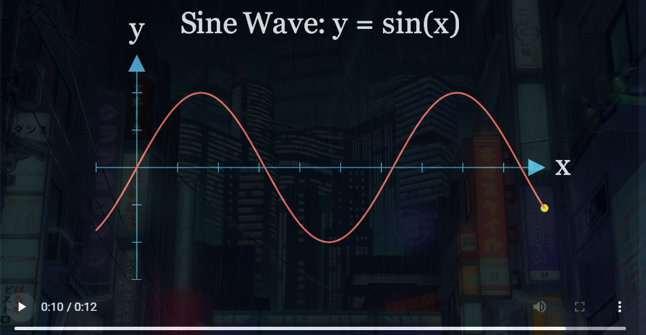

# Model Context Protocol (MCP) Server for creating Manim animations

A FastMCP-based tool for executing Manim animations through a server interface. This project provides a convenient way to generate mathematical animations using Manim through a controlled protocol.

## Features

- Execute Manim code through a FastMCP server
- Automatic temporary directory management
- Cleanup utilities for generated files

## Prerequisites

- Python 3.x
- Manim installation
- FastMCP

## Installation

1. Clone this repository:
```bash
git clone https://github.com/THAMIZH-ARASU/MCP-For-Manim.git
cd MCP_for_Manim
```

2. Install the required dependencies using uv package manager:
```bash
uv add [package name]
```

3. Set up Manim:
   - Install Manim following the [official installation guide](https://docs.manim.community/en/stable/installation.html)
   - Optionally, set the `MANIM_EXECUTABLE` environment variable to point to your Manim installation

## Configuration

The project uses the following environment variables:

- `MANIM_EXECUTABLE`: Path to the Manim executable (defaults to "manim" if not set)

## Usage

1. Start the MCP server:
```bash
python main.py
```

2. The server provides two main tools:

   - `execute_manim_code(manim_code: str)`: Executes Manim code and generates animations
   - `cleanup_manim_temp_dir(directory: str)`: Cleans up temporary directories after execution

### Example Code from Claude Desktop

```python
# Example Manim code
manim_code = """
from manim import *

class SimpleSineWave(Scene):
    def construct(self):
        # Create a number plane
        axes = NumberPlane(
            x_range=[-5, 5, 1],
            y_range=[-2, 2, 1],
            background_line_style={
                "stroke_color": BLUE_D,
                "stroke_width": 1,
                "stroke_opacity": 0.5
            }
        )
        
        # Create the sine function graph
        sine_function = axes.plot(
            lambda x: np.sin(x),
            x_range=[-5, 5],
            color=YELLOW
        )
        
        # Create a function label
        function_label = Text("y = sin(x)", color=YELLOW).scale(0.7)
        function_label.to_corner(UR).shift(DOWN + LEFT)
        
        # Draw everything
        self.play(Create(axes))
        self.play(Create(sine_function))
        self.play(Write(function_label))
        
        # Create a dot to move along the sine wave
        dot = Dot(color=RED)
        dot.move_to(axes.c2p(-5, np.sin(-5)))
        
        self.play(Create(dot))
        
        # Move the dot along the sine wave
        self.play(
            dot.animate.move_to(axes.c2p(5, np.sin(5))),
            rate_func=linear,
            run_time=6
        )
        
        self.wait(1)
"""

# Execute the code
result = execute_manim_code(manim_code)
```

## Viewing Output Videos

After executing Manim code, the generated videos can be found in the following locations:

1. **Main Output Directory**: `media/`
   - Contains all generated animations and assets
   - Videos are typically stored in `media/videos/` subdirectory

2. **Temporary Directory**: `media/manim_tmp/`
   - Contains the latest generated video and scene files
   - Useful for debugging and immediate access to the most recent output

The output files follow Manim's naming convention:
- Video files: `[SceneName]_[Quality].mp4`
- Example: `SquareToCircle_1080p.mp4`

<p align="center">
  
</p>

You can view the videos using any standard video player. The console output will also display the path to the generated video after successful execution.

## Directory Structure

- `media/`: Base directory for generated animations
- `media/manim_tmp/`: Temporary directory for Manim execution

## Contributing

Contributions are welcome! Please feel free to submit a Pull Request.

## License

This MCP Server is licensed with MIT License

## Acknowledgments

- [Manim Community](https://docs.manim.community/)
- [FastMCP](https://github.com/fastmcp/fastmcp)
